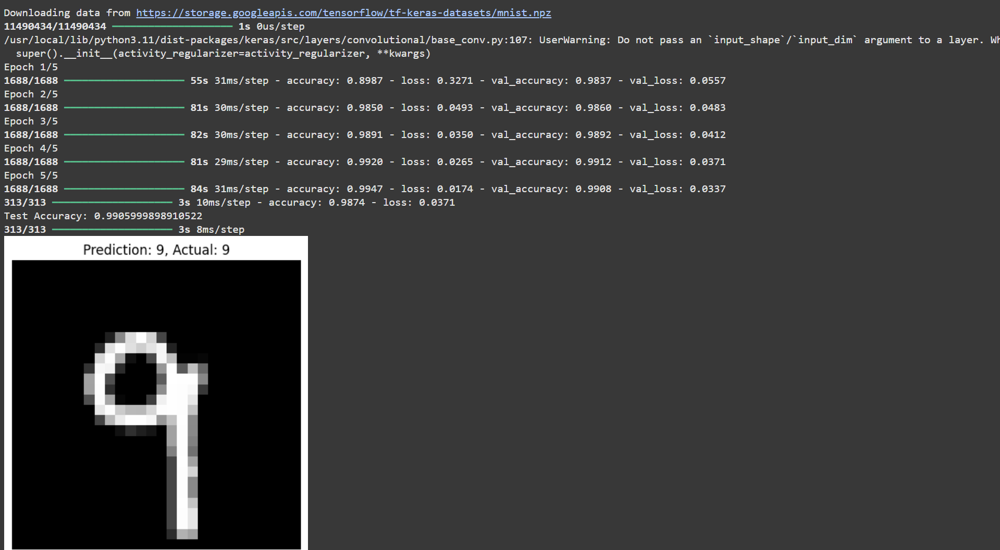

# cnn-digit-classifier
CNN model to classify handwritten digits using TensorFlow/Keras
# 🧠 CNN Digit Classifier (MNIST)

A Convolutional Neural Network (CNN) built using TensorFlow and Keras to classify handwritten digits (0–9) from the MNIST dataset.

This is my first Deep Learning project as part of my journey to become an AI Engineer, aimed at building a strong resume for internships, freelance jobs, and top AI scholarships like MBZUAI.

---

## 📊 Model Accuracy

- ✅ **Training Accuracy:** ~99%
- ✅ **Test Accuracy:** ~98%
- ✅ **Frameworks:** TensorFlow 2, Keras API

---

## 🖼 Sample Output Screenshot

Here’s a sample prediction from the model:



> ✨ Replace `screenshot.png` with your actual screenshot filename when uploading it to GitHub

---

## 🛠 Technologies Used

- Python
- TensorFlow + Keras
- Matplotlib
- NumPy
- Google Colab

---

## 📁 Dataset

---

## 🙋‍♂️ About Me

Hi, I'm **Muhammad Rayan Shahid** — a 15-year-old aspiring AI Engineer from Karachi 🇵🇰.


- 💻 Freelancer building real-world AI solutions
- 🎙️ Founder of [ByteBrilliance AI](https://www.youtube.com/@ByteBrillianceAI)
- 📚 Passionate about mastering AI and helping the Ummah with technology

📬 **Let's connect:**  
🔗 [GitHub](https://github.com/rayan-ai) | 🎥 [YouTube](https://www.youtube.com/@ByteBrillianceAI)

> *“Building intelligent systems with purpose, not just code.”*


The model is trained on the **MNIST dataset**, which consists of 60,000 training and 10,000 test images of handwritten digits (0–9), grayscale 28x28 pixels.

This dataset is available directly via TensorFlow:

```python
(X_train, y_train), (X_test, y_test) = tf.keras.datasets.mnist.load_data()

